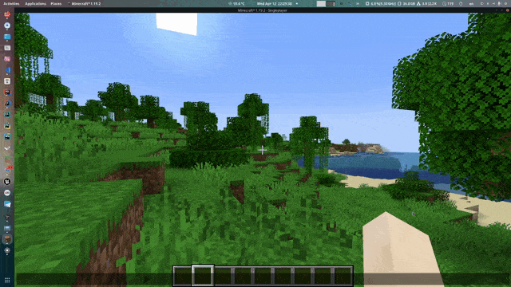
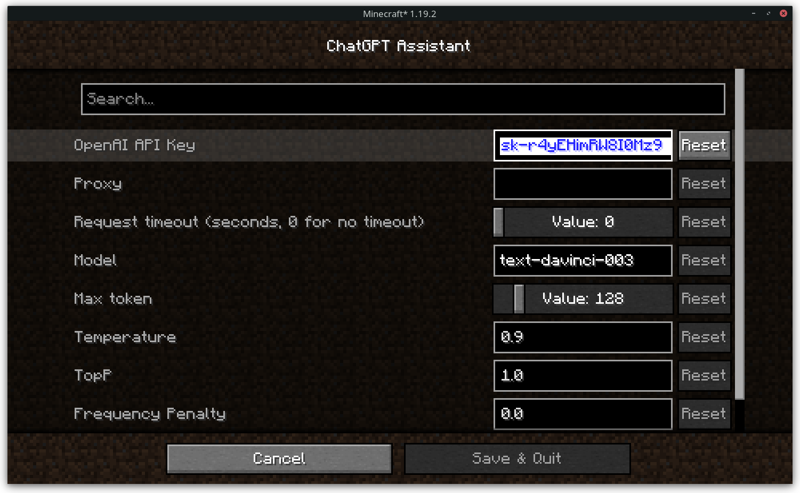
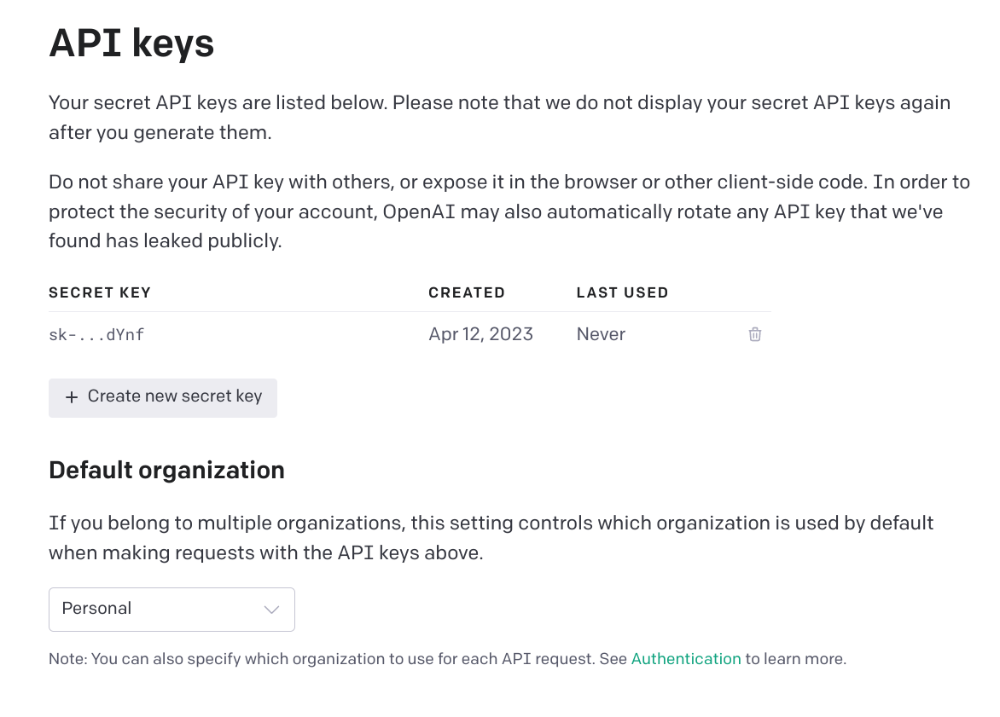

# Minecraft ChatGPT Assistant

[](https://fabricmc.net/)[](https://minecraft.net/)

Please give me a star🌟 if you like it!



This mod is still at a very early stage of development and may have some bugs. 
If you find any bugs, please report them to [GitHub Issues](https://github.com/RIvance/minecraft-chatgpt-assistant/issues).

## Usage

Press `t` to open the chat HUD. Type whatever you want prefixed with `:` in nature languages and press enter. For example:
```
:give me an apple
:give me a diamond sword with the best enchants
:kill all mobs
:kill the dragon
:easy mode
:disable mob spawning
:spawn a zombie with all enchanted diamond armors
```
or even something shorter
```
:food
:hard
:day
:night
:stop rainning
:64 golden apples
:speed 2
```

## Configuration



### API Key

The API key is used to access the OpenAI API.
Please set the API key in the configuration menu before using the mod.
Otherwise, the mod will not work.

### Proxy (Optional)

If you want to access the OpenAI API through a proxy, you can set the proxy in the configuration menu.

### Response Timeout

The response timeout is used to set the timeout of the OpenAI API response. 
Set the value to 0 to disable the timeout.

### Model

The model used by the OpenAI API.
See [OpenAI API Documentation](https://platform.openai.com/docs/api-reference/models) for more information.

## How can I get the API key?

You can get the API key from [OpenAI](https://platform.openai.com/account/api-keys). 
Click the "Create new secret key" button to create a new key.


